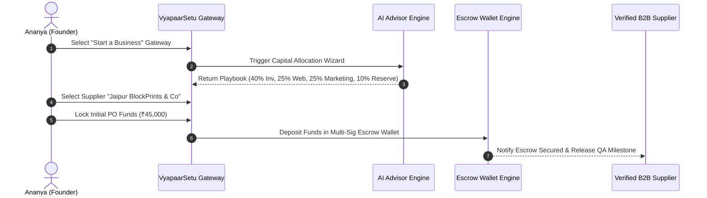

# VyapaarSetu User Journey Maps

```mermaid
sequenceDiagram
    autonumber
    actor Founder as Ananya (Founder)
    participant UX as VyapaarSetu Gateway
    participant AI as AI Advisor Engine
    participant Escrow as Escrow Wallet Engine
    participant Vendor as Verified B2B Supplier

    Founder->>UX: Select "Start a Business" Gateway
    UX->>AI: Trigger Capital Allocation Wizard
    AI-->>UX: Return Playbook (40% Inv, 25% Web, 25% Marketing, 10% Reserve)
    Founder->>UX: Select Supplier "Jaipur BlockPrints & Co"
    Founder->>UX: Lock Initial PO Funds (₹45,000)
    UX->>Escrow: Deposit Funds in Multi-Sig Escrow Wallet
    Escrow-->>Vendor: Notify Escrow Secured & Release QA Milestone
```
