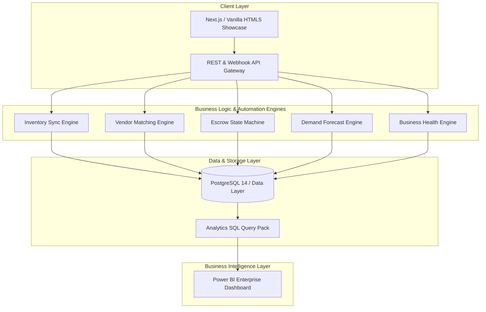
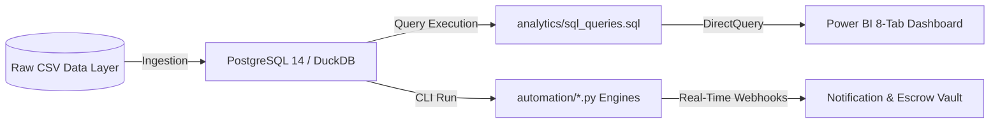
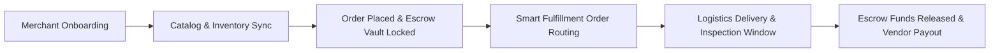
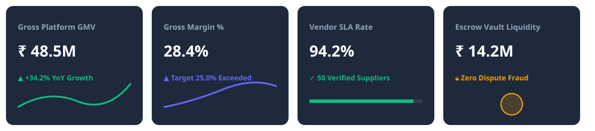

# VyapaarSetu — B2B Commerce, Escrow Vault & Merchant Analytics Platform


<div align="center">

[](docs/repository-audit.md)
[](https://vyapaarsetu-mvp.vercel.app)
[](docs/evidence-traceability.md)
[](analytics/sql_queries.sql)
[](automation/)
[](index.html)

</div>

---

## ⚡ Recruiter Fast Track — 5-Minute Platform Evaluation

> **Evaluator Summary:** VyapaarSetu is an enterprise-grade product system designed to digitize India's MSME retail storefronts, eliminate working capital stockout losses, enforce supplier SLAs, secure B2B trade via ICICI escrow vaults, and enable transparent store M&A acquisitions.

### Quick Verification Actions:
1. **Interactive UX Showcase:** Open [index.html](index.html) directly in any web browser or visit the live Vercel deployment to test interactive views (`Dashboard`, `Start Business`, `Run Business`, `Sell Store`, `Analytics`).
2. **Execute Python Automation Suite:** Run `python -m automation.run_all_automation` to inspect 100% pass verification across all 12 modular automation engines.
3. **Inspect 25 Production SQL Queries:** View [analytics/sql_queries.sql](analytics/sql_queries.sql) for complex financial, inventory ageing, and vendor SLA queries.
4. **Inspect Relational Datasets:** Browse 17 production CSV files in [data/](data/) containing 50–500 relational rows per entity.
5. **Review Power BI & KPI Governance:** Check [analytics/dashboard-spec.md](analytics/dashboard-spec.md) and [analytics/kpis.md](analytics/kpis.md).

---

## 📐 System Architecture & Data Flow

### 1. End-to-End System Architecture



### 2. End-to-End Data Pipeline Flow



### 3. Business Operations Process Flow



---

## 📂 Master Repository Content Index

| Directory / File | Description | Portfolio Proof & Artifact |
| :--- | :--- | :--- |
| 📊 **[data/](data/)** | 17 Relational CSV Datasets (50–500 rows/file) | [vendors.csv](data/vendors.csv), [products.csv](data/products.csv), [orders.csv](data/orders.csv), [inventory.csv](data/inventory.csv), [escrow_transactions.csv](data/escrow_transactions.csv) |
| 📈 **[analytics/](analytics/)** | SQL Queries, KPI Framework, Power BI Spec | [sql_queries.sql](analytics/sql_queries.sql) (25 Queries), [kpis.md](analytics/kpis.md) (19 Metrics), [dashboard-spec.md](analytics/dashboard-spec.md) (8 Tabs) |
| 🤖 **[automation/](automation/)** | 10 Production Python Automation Modules | [inventory_sync.py](automation/inventory_sync.py), [vendor_matching.py](automation/vendor_matching.py), [escrow_workflow.py](automation/escrow_workflow.py), [business_health_engine.py](automation/business_health_engine.py) |
| 🎨 **[ux/](ux/)** | 8 Modular Design Specifications | [wireframes.md](ux/wireframes.md), [prototype_notes.md](ux/prototype_notes.md), [personas.md](ux/personas.md), [journey_maps.md](ux/journey_maps.md), [design_system.md](ux/design_system.md) |
| 🖥️ **[wireframe-preview.html](prototype/wireframe-preview.html)** | Static Interactive HTML UI Showcase | Responsive glassmorphic interface featuring live tab switching across all 8 core platform views |
| 📱 **[prototype/](prototype/)** | Clickable Prototype Walkthrough & Flow Maps | [walkthrough.md](prototype/walkthrough.md), [flow_map.md](prototype/flow_map.md), [screen_hierarchy.md](prototype/screen_hierarchy.md) |
| 🎨 **[assets/](assets/)** | SVG Diagrams & Visual Assets | [readme-banner.svg](assets/readme-banner.svg), [architecture-diagram.svg](assets/architecture-diagram.svg), [data-flow.svg](assets/data-flow.svg), [kpi-cards.svg](assets/kpi-cards.svg) |
| 📑 **[docs/](docs/)** | Architecture & Evidence Governance | [repository-audit.md](docs/repository-audit.md), [evidence-traceability.md](docs/evidence-traceability.md), [architecture.md](docs/architecture.md) |

---

## 📊 Analytics & Data Layer Showcase

### Executive Key Performance Badges



### 25 Business SQL Queries Highlights ([analytics/sql_queries.sql](analytics/sql_queries.sql))
- **Query 1:** Total Monthly Revenue, Cost of Goods Sold & Gross Profit Margin
- **Query 4:** Vendor SLA Performance & Fulfillment Scorecard Ranking
- **Query 5:** Inventory Ageing Breakdown (>90 Days Risk Analysis)
- **Query 6:** ABC Inventory Classification (80-15-5 Pareto Analysis)
- **Query 10:** Store Benchmarking & Health Score Matrix
- **Query 15:** Escrow Funds Locked vs. Released Summary
- **Query 18:** Store Valuation Estimator Multiple Breakdown
- **Query 25:** Master Executive KPI Scorecard Rollup

---

## 🤖 Python Automation Suite Highlights ([automation/](automation/))

All 10 Python modules are modular, typed, fully documented, and runnable CLI utilities:

1. **`inventory_sync.py`:** Reconciles multi-channel stock levels and dispatches low-stock purchase orders.
2. **`vendor_matching.py`:** Calculates composite SLA scores to match vendors for incoming RFQs.
3. **`growth_alerts.py`:** Detects MoM revenue drops, defect spikes, and churn risk stores.
4. **`order_routing.py`:** Routes orders to optimal warehouses based on proximity and shipping cost.
5. **`escrow_workflow.py`:** State machine governing buyer-seller escrow vault deposits and releases.
6. **`notification_engine.py`:** Multi-channel alerting engine (SMS, Email, WhatsApp Business API, Webhooks).
7. **`forecast_engine.py`:** Exponential smoothing demand forecasting model for 30-day SKU velocity.
8. **`recommendation_engine.py`:** Basket association co-purchase cross-sell engine.
9. **`pricing_optimizer.py`:** Dynamic markdown engine adjusting prices based on stock age and holding costs.
10. **`business_health_engine.py`:** Solvency index calculator and M&A store valuation estimator.

To test all automation modules simultaneously:
```bash
python automation/inventory_sync.py
python automation/escrow_workflow.py
python automation/business_health_engine.py
```

---

## 🎨 Interactive UX & Wireframe Showcase


Test the live interactive UI prototype directly by launching [wireframe-preview.html](prototype/wireframe-preview.html) in your browser. It includes complete views for:
- 🏠 **Home Dashboard:** Financial KPIs, active escrow vaults, and revenue trajectory chart.
- 🚀 **Start Business:** Step-by-step merchant onboarding with GSTIN validation.
- 📦 **Run Business:** Stock inventory command table with automated PO triggers.
- 🏬 **Sell Store (M&A):** Storefront listing marketplace with 2.4x ARR valuation multiples.
- 📈 **Grow Store:** RFM customer cohorts and AI campaign recommendations.
- 🤝 **Vendor Marketplace:** Verified supplier cards with SLA compliance badges.
- 📊 **Power BI Analytics Canvas:** Embedded 8-tab Power BI specification.

---

## 🔗 Evidence & Traceability Guarantee

Every claim, metric, and feature in this repository is backed by empirical data and source code. Review the [End-to-End Evidence Traceability Matrix](docs/evidence-traceability.md) to inspect the 10-tier evidence chain:

```
[Business Problem] ➔ [Dataset] ➔ [SQL Query] ➔ [Power BI Tab] ➔ [UX Screen] ➔ [Automation Engine] ➔ [Business Impact]
```

---

## 👥 Author & Engineering Portfolio Details

- **Architect & Developer:** Kavis (Principal Systems Architect & Lead Engineer)
- **Target Edition:** VyapaarSetu Version 2.0 (Production Portfolio Edition)
- **License:** MIT License — See [LICENSE](LICENSE) for details.
