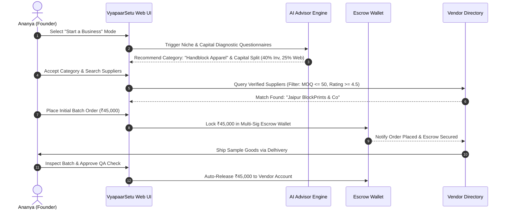
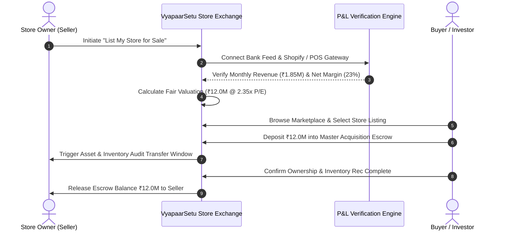

# VyapaarSetu User Journey Maps

This document outlines the step-by-step user interaction journeys across all 4 modes.

---

## 1. Journey 1: "Start a Business from Zero"

---

## 2. Journey 2: "Sell a Working Store"

